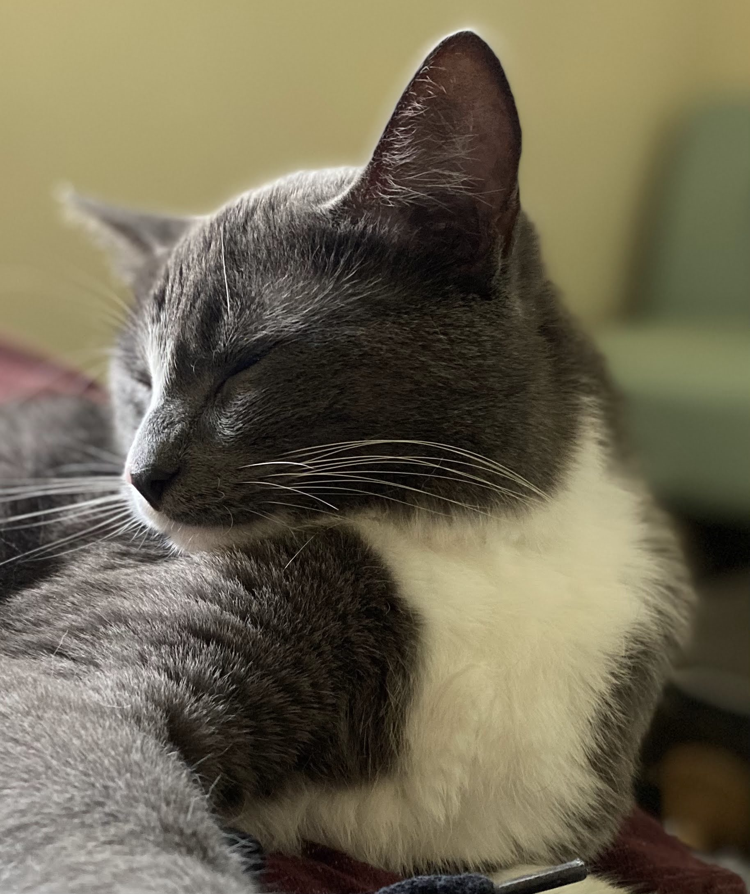

```{css,echo=FALSE}
h1, h2, h3 {
  text-align:center;
}
p {
  font-size: 24px;
}
img[src*='#center'] { 
    display: block;
    margin: auto;
}

    <!-- To align left, add a colon to the left, like :--- (this is the default) -->
    <!-- For right alignment, add a colon to the right, like: ---: -->
    <!-- And finally, for center alignment, add two colons, like: :---: -->
```

# The many faces of Ernie Benernie Gundermann

  |      
:-: | :-: 
{width=50%} | {width=50%}
{width=50%} | {width=50%}


