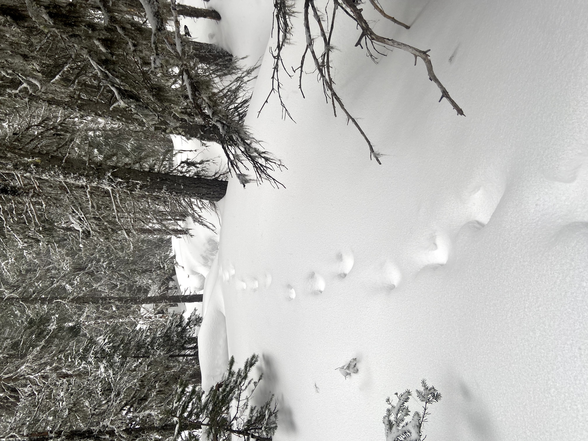
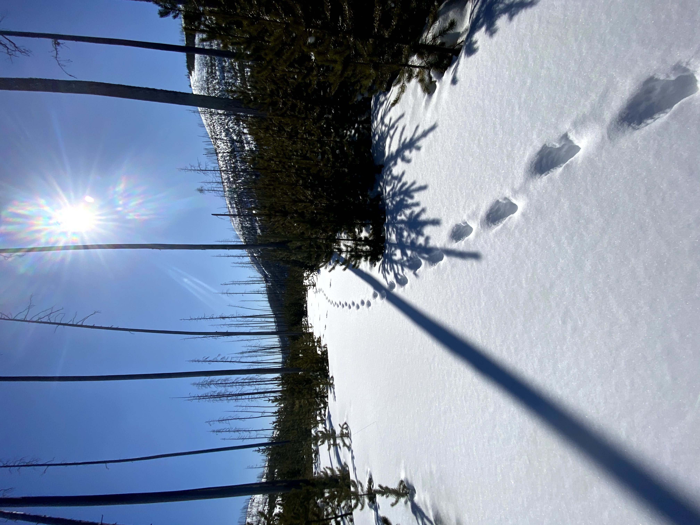
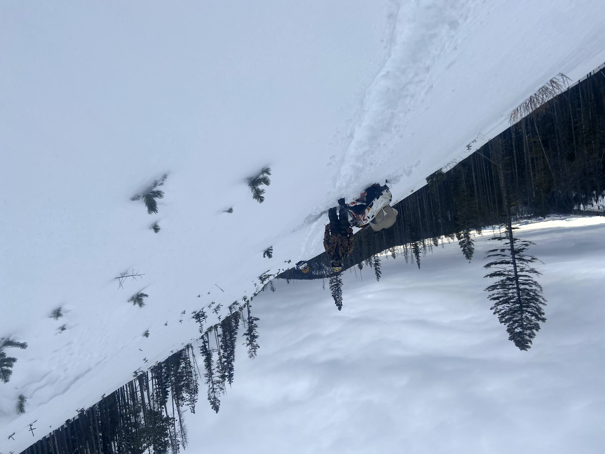

```{css,echo=FALSE}
h1, h2, h3 {
  text-align:center;
}
p {
  font-size: 18px;
}
img[src*='#center'] { 
    display: block;
    margin: auto;
}
```


In the summer of 2022, I earned my MSc in Wildife and Fisheries Science from Penn State. My research focused on furthering our understanding of how ungulates in central Pennsylvania shifted their movement patterns in reponse to changes in reproductive status and hunting pressure. During my MSc I developed a deep love for R and a special relationship for statistics, summed up best by Facebook's most notorios relationship status. \
{width=50%} \
\
Prior to my MSc work, I obtained my BSc from the University of Delaware in 2017 and from 2017-2020 I worked as a wildlife research technician on a variety of projects, with a focus on non-invasive surveying on mesocarnivores. 

### Multi-Species Mesocarnivore Monitoring Project
  |   |   |   
- | - | - | - 
 |  |  | 
### Klamath-Siskiyou Carnivore Project
  |   |   |   
- | - | - | - 
 |  |  | 

### Northwest Boreal Lynx Project
  |   |   |   
- | - | - | - 
 |  |  | 

# Additionally
In my free time I love crafting, enjoying craft beer, adventuring in the outdoors, and spending time with my cat, Ernie.

When I procrastinate I usually take on a coding challenge beyond my scope - which includes making this website. So if you are reading this there is more to come but this is as far as I got... for now. :)
